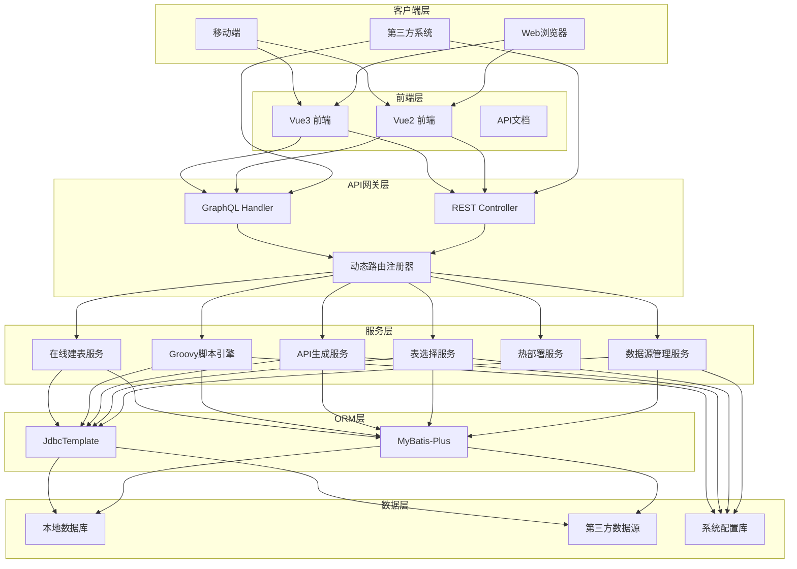
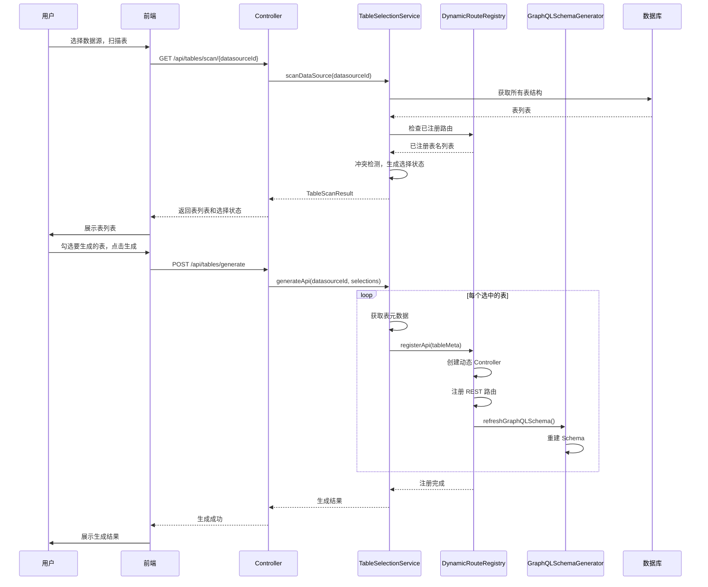
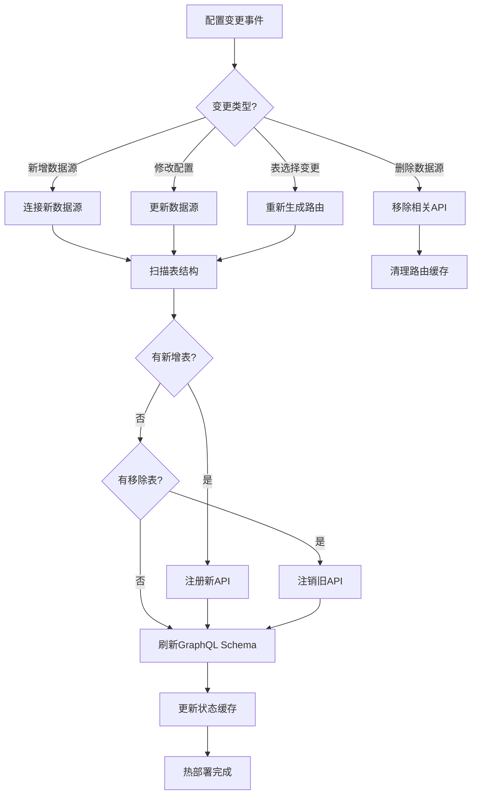

# Auto-API-Generator 设计文档

## 1. 概述

### 1.1 项目简介
Auto-API-Generator 是一个基于 Spring Boot 2 的自动化 API 接口生成组件包，支持 REST 和 GraphQL 双协议。该组件能够根据数据库表结构自动生成对应的 API 接口，并提供在线 Groovy 脚本编写功能，支持动态热部署。组件设计为可复用的 Spring Boot Starter，可被微服务等外部系统便捷引入并调用。

### 1.2 设计目标
- **自动化**：根据数据库表结构自动生成 CRUD API，减少重复劳动
- **灵活性**：支持手动选择表、冲突检测跳过、全量自动等多种生成模式
- **热部署**：配置变更无需重启，API 路由动态刷新
- **可扩展**：作为 Starter 被其他系统便捷引入，支持自定义扩展
- **安全性**：Groovy 脚本沙箱限制，防止危险操作

### 1.3 技术栈
| 类别 | 技术 | 版本 |
|------|------|------|
| 后端框架 | Spring Boot | 2.7.x |
| ORM 框架 | MyBatis-Plus | 3.5.x |
| GraphQL | graphql-java | 20.x |
| 脚本引擎 | Groovy | 3.0.x |
| 数据库 | MySQL / PostgreSQL | 5.7+ / 10+ |
| 连接池 | Druid | 1.2.x |
| 前端框架 | Vue 2 / Vue 3 | 2.7.x / 3.3.x |
| UI 库 | Element UI / Element Plus | 2.x / 2.x |

---

## 2. 架构设计

### 2.1 整体架构图



### 2.2 模块划分

```
auto-api-generator/
├── auto-api-core/                          # 核心模块
│   ├── src/main/java/com/iflow/api/core/
│   │   ├── config/                         # 配置类
│   │   │   ├── AutoApiConfig.java          # 主配置类
│   │   │   ├── GraphQLConfig.java          # GraphQL 配置
│   │   │   ├── GroovyConfig.java           # Groovy 脚本引擎配置
│   │   │   └── DatasourceConfig.java       # 数据源配置
│   │   │
│   │   ├── controller/                     # 控制器
│   │   │   ├── TableController.java        # 表管理控制器
│   │   │   ├── DatasourceController.java   # 数据源控制器
│   │   │   ├── ScriptController.java       # 脚本控制器
│   │   │   ├── TableCreateController.java  # 在线建表控制器
│   │   │   └── DynamicApiController.java   # 动态 API 控制器
│   │   │
│   │   ├── service/                        # 服务层
│   │   │   ├── DatasourceService.java      # 数据源管理服务
│   │   │   ├── MetadataService.java        # 元数据服务
│   │   │   ├── TableSelectionService.java  # 表选择服务
│   │   │   ├── ApiGenerationService.java   # API 生成服务
│   │   │   ├── GroovyScriptService.java    # Groovy 脚本服务
│   │   │   ├── HotDeployService.java       # 热部署服务
│   │   │   ├── TableCreateService.java     # 在线建表服务
│   │   │   └── GenericQueryService.java    # 通用查询服务
│   │   │
│   │   ├── repository/                     # 数据访问层
│   │   │   ├── DatasourceConfigRepository.java
│   │   │   ├── TableSelectionRepository.java
│   │   │   ├── ApiGenerationStatusRepository.java
│   │   │   ├── ScriptRepository.java
│   │   │   └── ScriptVersionRepository.java
│   │   │
│   │   ├── entity/                         # 实体类
│   │   │   ├── DatasourceConfig.java
│   │   │   ├── TableSelection.java
│   │   │   ├── ApiGenerationStatus.java
│   │   │   ├── Script.java
│   │   │   └── ScriptVersion.java
│   │   │
│   │   ├── dto/                            # 数据传输对象
│   │   │   ├── TableMeta.java              # 表元数据
│   │   │   ├── ColumnMeta.java             # 字段元数据
│   │   │   ├── TableInfo.java              # 表信息（前端展示用）
│   │   │   ├── TableScanResult.java        # 扫描结果
│   │   │   ├── ScriptContext.java          # 脚本执行上下文
│   │   │   └── ApiResponse.java            # 统一响应
│   │   │
│   │   ├── graphql/                        # GraphQL 相关
│   │   │   ├── GraphQLSchemaGenerator.java # Schema 生成器
│   │   │   ├── GraphQLResolver.java        # 解析器
│   │   │   └── DataFetcherRegistry.java    # DataFetcher 注册表
│   │   │
│   │   ├── groovy/                         # Groovy 脚本引擎
│   │   │   ├── GroovySandbox.java          # 沙箱限制
│   │   │   ├── GroovyScriptExecutor.java   # 脚本执行器
│   │   │   └── ScriptClassLoader.java      # 脚本类加载器
│   │   │
│   │   ├── datasource/                     # 多数据源管理
│   │   │   ├── DynamicDataSource.java      # 动态数据源
│   │   │   ├── DataSourceRegistry.java     # 数据源注册表
│   │   │   └── DataSourceHolder.java       # 数据源上下文持有者
│   │   │
│   │   ├── dynamic/                        # 动态路由
│   │   │   ├── DynamicRouteRegistry.java   # 路由注册器
│   │   │   ├── DynamicController.java      # 动态控制器
│   │   │   └── RouteRefreshListener.java   # 路由刷新监听器
│   │   │
│   │   └── util/                           # 工具类
│   │       ├── TypeConverter.java          # 类型转换器
│   │       ├── SqlGenerator.java           # SQL 生成器
│   │       └── NamingConverter.java        # 命名转换器
│   │
│   └── src/main/resources/
│       ├── graphql/                        # GraphQL 资源
│       └── application.yml                 # 默认配置
│
├── auto-api-starter/                       # Spring Boot Starter
│   ├── pom.xml
│   └── src/main/java/com/iflow/api/starter/
│       └── AutoApiAutoConfiguration.java   # 自动配置类
│
├── auto-web-vue2/                          # Vue2 前端
│   ├── public/
│   ├── src/
│   │   ├── api/                            # API 接口封装
│   │   ├── components/                     # 通用组件
│   │   ├── views/                          # 页面视图
│   │   │   ├── datasource/                 # 数据源管理
│   │   │   ├── table-select/               # 表选择
│   │   │   ├── table-create/               # 在线建表
│   │   │   ├── script-editor/              # 脚本编辑
│   │   │   └── api-docs/                   # API 文档
│   │   ├── store/                          # Vuex 状态管理
│   │   └── router/                         # 路由配置
│   └── package.json
│
├── auto-web-vue3/                          # Vue3 前端
│   ├── public/
│   ├── src/
│   │   ├── api/
│   │   ├── components/
│   │   ├── views/
│   │   ├── stores/                         # Pinia 状态管理
│   │   └── router/
│   └── package.json
│
└── docs/specs/
    ├── requirements.md                     # 需求文档
    └── design.md                           # 设计文档
```

### 2.3 核心流程图

#### 2.3.1 API 生成流程



#### 2.3.2 热部署流程



---

## 3. 组件与接口设计

### 3.1 核心组件

#### 3.1.1 动态路由注册器（DynamicRouteRegistry）

**职责**：管理动态生成的 API 路由，支持热注册和热注销

```java
@Component
public class DynamicRouteRegistry implements ApplicationContextAware {
    
    private ApplicationContext applicationContext;
    
    // 已注册的控制器缓存
    private final Map<String, ControllerInfo> registeredControllers = new ConcurrentHashMap<>();
    
    // 已注册的 GraphQL Schema
    private volatile GraphQLSchema graphQLSchema;
    
    @Autowired
    private RequestMappingHandlerMapping requestMappingHandlerMapping;
    
    @Autowired
    private GraphQLSchemaGenerator graphQLSchemaGenerator;
    
    @Autowired
    private TableSelectionService tableSelectionService;
    
    /**
     * 注册单个表的 API（热部署）
     */
    public synchronized void registerApi(TableMeta table) {
        String tableName = table.getTableName();
        String controllerPath = "/api/" + NamingConverter.toCamelCase(tableName);
        
        // 1. 创建动态 Controller 实例
        DynamicController controller = createDynamicController(table);
        
        // 2. 注册到 Spring 容器
        registerControllerBean(tableName, controller);
        
        // 3. 注册 REST 路由
        registerRestRoutes(controller, controllerPath, table);
        
        // 4. 刷新 GraphQL Schema
        refreshGraphQLSchema();
        
        // 5. 更新缓存
        registeredControllers.put(tableName, new ControllerInfo(controller, controllerPath));
        
        log.info("API registered: {} -> {}", tableName, controllerPath);
    }
    
    /**
     * 注销单个表的 API（热部署）
     */
    public synchronized void unregisterApi(String tableName) {
        // 1. 移除 Bean
        removeControllerBean(tableName);
        
        // 2. 清理缓存
        registeredControllers.remove(tableName);
        
        // 3. 刷新 GraphQL Schema
        refreshGraphQLSchema();
        
        log.info("API unregistered: {}", tableName);
    }
    
    /**
     * 热刷新所有 API
     */
    public synchronized void hotRefresh() {
        // 1. 清理所有动态路由
        clearAllDynamicRoutes();
        
        // 2. 重新扫描并注册
        refreshAllApis();
        
        log.info("Hot refresh completed: {} APIs registered", registeredControllers.size());
    }
    
    /**
     * 获取已注册的表名列表
     */
    public Set<String> getRegisteredTableNames() {
        return registeredControllers.keySet();
    }
    
    /**
     * 获取 GraphQL Schema
     */
    public GraphQLSchema getGraphQLSchema() {
        return graphQLSchema;
    }
}
```

#### 3.1.2 GraphQL Schema 生成器（GraphQLSchemaGenerator）

**职责**：根据表结构动态生成 GraphQL Schema

```java
@Component
public class GraphQLSchemaGenerator {
    
    @Autowired
    private DataFetcherRegistry dataFetcherRegistry;
    
    /**
     * 构建完整的 GraphQL Schema
     */
    public GraphQLSchema buildSchema(List<TableMeta> tables) {
        // 1. 构建 Type 定义
        List<GraphQLTypeDefinition> typeDefinitions = tables.stream()
            .map(this::buildObjectType)
            .collect(Collectors.toList());
        
        // 2. 构建 Query 类型
        GraphQLObjectType queryType = buildQueryType(tables);
        
        // 3. 构建 Mutation 类型
        GraphQLObjectType mutationType = buildMutationType(tables);
        
        // 4. 构建输入类型（用于 Mutation）
        List<GraphQLInputTypeDefinition> inputTypes = tables.stream()
            .map(this::buildInputType)
            .collect(Collectors.toList());
        
        // 5. 构建连接类型（分页）
        List<GraphQLTypeDefinition> connectionTypes = tables.stream()
            .map(this::buildConnectionType)
            .collect(Collectors.toList());
        
        // 6. 组装 Schema
        return GraphQLSchema.newSchema()
            .query(queryType)
            .mutation(mutationType)
            .build();
    }
    
    /**
     * 根据表结构生成 ObjectType
     */
    private GraphQLObjectType buildObjectType(TableMeta table) {
        List<GraphQLFieldDefinition> fields = new ArrayList<>();
        
        // 添加字段
        for (ColumnMeta column : table.getColumns()) {
            GraphQLType fieldType = mapToGraphQLType(column.getJavaType());
            fields.add(GraphQLFieldDefinition.newFieldDefinition()
                .name(column.getName())
                .type(column.getNullable() ? fieldType : fieldType.notNull())
                .build());
        }
        
        return GraphQLObjectType.newObject()
            .name(NamingConverter.toPascalCase(table.getTableName()))
            .fields(fields)
            .build();
    }
    
    /**
     * 构建 Query 类型
     */
    private GraphQLObjectType buildQueryType(List<TableMeta> tables) {
        List<GraphQLFieldDefinition> queryFields = new ArrayList<>();
        String typeName = NamingConverter.toPascalCase(table.getTableName());
        
        // 列表查询（支持分页）
        queryFields.add(GraphQLFieldDefinition.newFieldDefinition()
            .name(typeName + "List")
            .type(GraphQLList.list(GraphQLTypeReference.typeRef(typeName)))
            .dataFetcher(env -> handleListQuery(table, env))
            .argument(buildPaginationArguments())
            .argument(buildFilterArguments(table))
            .build());
        
        // 单条查询
        queryFields.add(GraphQLFieldDefinition.newFieldDefinition()
            .name(typeName)
            .type(GraphQLTypeReference.typeRef(typeName))
            .dataFetcher(env -> handleSingleQuery(table, env))
            .argument(GraphQLArgument.newArgument()
                .name("id")
                .type(GraphQLNonNull.nonNull(GraphQLID))
                .build())
            .build());
        
        return GraphQLObjectType.newObject()
            .name("Query")
            .fields(queryFields)
            .build();
    }
    
    /**
     * 构建 Mutation 类型
     */
    private GraphQLObjectType buildMutationType(List<TableMeta> tables) {
        List<GraphQLFieldDefinition> mutationFields = new ArrayList<>();
        
        // Create
        mutationFields.add(GraphQLFieldDefinition.newFieldDefinition()
            .name("create" + typeName)
            .type(GraphQLTypeReference.typeRef(typeName))
            .dataFetcher(env -> handleCreate(table, env))
            .argument(GraphQLArgument.newArgument()
                .name("input")
                .type(GraphQLNonNull.nonNull(GraphQLTypeReference.typeRef(typeName + "Input")))
                .build())
            .build());
        
        // Update
        mutationFields.add(GraphQLFieldDefinition.newFieldDefinition()
            .name("update" + typeName)
            .type(GraphQLBoolean)
            .dataFetcher(env -> handleUpdate(table, env))
            .argument(GraphQLArgument.newArgument()
                .name("id")
                .type(GraphQLNonNull.nonNull(GraphQLID))
                .build())
            .argument(GraphQLArgument.newArgument()
                .name("input")
                .type(GraphQLTypeReference.typeRef(typeName + "Input"))
                .build())
            .build());
        
        // Delete
        mutationFields.add(GraphQLFieldDefinition.newFieldDefinition()
            .name("delete" + typeName)
            .type(GraphQLBoolean)
            .dataFetcher(env -> handleDelete(table, env))
            .argument(GraphQLArgument.newArgument()
                .name("id")
                .type(GraphQLNonNull.nonNull(GraphQLID))
                .build())
            .build());
        
        return GraphQLObjectType.newObject()
            .name("Mutation")
            .fields(mutationFields)
            .build();
    }
    
    /**
     * Java 类型映射到 GraphQL 类型
     */
    private GraphQLType mapToGraphQLType(String javaType) {
        switch (javaType) {
            case "Long":
            case "Integer":
            case "Short":
            case "Byte":
                return GraphQLLong;
            case "Float":
            case "Double":
            case "BigDecimal":
                return GraphQLFloat;
            case "Boolean":
                return GraphQLBoolean;
            case "String":
                return GraphQLString;
            case "LocalDateTime":
            case "LocalDate":
                return GraphQLString; // 可自定义 DateTime 类型
            case "byte[]":
                return GraphQLString;
            default:
                return GraphQLString;
        }
    }
}
```

#### 3.1.3 Groovy 脚本引擎（GroovyScriptService）

**职责**：安全执行 Groovy 脚本，支持沙箱限制

```java
@Service
public class GroovyScriptService {
    
    @Autowired
    private GroovySandbox groovySandbox;
    
    @Autowired
    private ScriptRepository scriptRepository;
    
    @Autowired
    private ScriptVersionRepository versionRepository;
    
    @Autowired
    private GenericQueryService queryService;
    
    /**
     * 执行脚本
     */
    public Object execute(Long scriptId, ScriptContext context) {
        Script script = scriptRepository.findById(scriptId)
            .orElseThrow(() -> new ScriptNotFoundException(scriptId));
        
        // 编译脚本（带缓存）
        Script compiledScript = compileScript(script.getContent());
        
        // 设置绑定变量
        Binding binding = createBinding(script, context);
        
        // 执行脚本
        try {
            // 沙箱检查已在编译阶段完成
            Object result = compiledScript.run(binding, binding);
            
            // 记录执行日志
            logScriptExecution(scriptId, context, result, null);
            
            return result;
            
        } catch (Exception e) {
            logScriptExecution(scriptId, context, null, e);
            throw new ScriptExecutionException("Script execution failed", e);
        }
    }
    
    /**
     * 编译脚本（带沙箱限制）
     */
    private Script compileScript(String scriptContent) {
        // 使用沙箱编译
        return groovySandbox.compile(scriptContent);
    }
    
    /**
     * 创建绑定上下文
     */
    private Binding createBinding(Script script, ScriptContext context) {
        Binding binding = new Binding();
        
        // 注入常用变量
        binding.setVariable("request", context.getRequest());
        binding.setVariable("response", context.getResponse());
        binding.setVariable("params", context.getParams());
        
        // 注入数据库操作类
        binding.setVariable("db", queryService);
        
        // 注入工具类
        binding.setVariable("util", new ScriptUtils());
        
        return binding;
    }
    
    /**
     * 保存新版本
     */
    @Transactional
    public ScriptVersion saveVersion(Script script, String content) {
        // 保存脚本
        script.setContent(content);
        script.setVersion(script.getVersion() + 1);
        scriptRepository.save(script);
        
        // 保存版本历史
        ScriptVersion version = new ScriptVersion();
        version.setScriptId(script.getId());
        version.setContent(content);
        version.setVersion(script.getVersion());
        version.setCreatedAt(LocalDateTime.now());
        versionRepository.save(version);
        
        return version;
    }
}
```

#### 3.1.4 Groovy 沙箱（GroovySandbox）

**职责**：限制 Groovy 脚本的危险操作

```java
@Component
public class GroovySandbox {
    
    private static final List<String> FORBIDDEN_METHODS = Arrays.asList(
        // 文件操作
        "newFile", "delete", "mkdir", "mkdirs", "renameTo",
        // 网络操作
        "openConnection", "openStream", "sendRequest",
        // 系统命令
        "exec", "load", "evaluate",
        // 反射操作（限制）
        "setAccessible", "defineClass"
    );
    
    private static final List<String> FORBIDDEN_CLASSES = Arrays.asList(
        "java.io.File",
        "java.nio.file.Files",
        "java.nio.file.Paths",
        "java.net.Socket",
        "java.net.URLConnection",
        "java.lang.ProcessBuilder",
        "java.lang.Runtime",
        "java.lang.System"
    );
    
    /**
     * 编译脚本（带安全检查）
     */
    public Script compile(String scriptContent) {
        // 1. 静态安全检查
        checkSecurity(scriptContent);
        
        // 2. 创建自定义 ClassLoader
        ClassLoader classLoader = createSecureClassLoader();
        
        // 3. 编译脚本
        GroovyClassLoader loader = new GroovyClassLoader(classLoader);
        return loader.parseClass(new GroovyCodeSource(scriptContent));
    }
    
    /**
     * 静态安全检查
     */
    private void checkSecurity(String scriptContent) {
        // 检查禁止的类
        for (String forbiddenClass : FORBIDDEN_CLASSES) {
            if (scriptContent.contains("import " + forbiddenClass) ||
                scriptContent.contains(forbiddenClass + ".")) {
                throw new SecurityException("Forbidden class: " + forbiddenClass);
            }
        }
        
        // 检查禁止的方法调用
        for (String method : FORBIDDEN_METHODS) {
            Pattern pattern = Pattern.compile("\\." + method + "\\s*\\(");
            if (pattern.matcher(scriptContent).find()) {
                throw new SecurityException("Forbidden method: " + method);
            }
        }
    }
    
    /**
     * 创建安全的 ClassLoader
     */
    private ClassLoader createSecureClassLoader() {
        return new SecureClassLoader(Thread.currentThread().getContextClassLoader()) {
            @Override
            protected Class<?> findClass(String name) throws ClassNotFoundException {
                // 禁止加载危险类
                for (String forbiddenClass : FORBIDDEN_CLASSES) {
                    if (name.startsWith(forbiddenClass)) {
                        throw new SecurityException("Forbidden class loading: " + name);
                    }
                }
                return super.findClass(name);
            }
        };
    }
}
```

### 3.2 接口设计

#### 3.2.1 REST API 接口

**数据源管理**

| 方法 | 路径 | 描述 |
|------|------|------|
| GET | /api/datasources | 获取数据源列表 |
| POST | /api/datasources | 添加数据源 |
| GET | /api/datasources/{id} | 获取数据源详情 |
| PUT | /api/datasources/{id} | 更新数据源 |
| DELETE | /api/datasources/{id} | 删除数据源 |
| POST | /api/datasources/{id}/test | 测试连接 |

**表管理**

| 方法 | 路径 | 描述 |
|------|------|------|
| GET | /api/tables/scan/{datasourceId} | 扫描数据源，获取所有表 |
| POST | /api/tables/selections | 保存表选择配置 |
| GET | /api/tables/status | 获取所有表的 API 生成状态 |
| POST | /api/tables/generate | 根据选择的表生成 API |
| POST | /api/tables/refresh | 热刷新 API 配置 |
| POST | /api/tables/{tableName}/remove | 移除指定表的 API |
| POST | /api/tables/{tableName}/force-generate | 强制生成（跳过冲突检测） |

**在线建表**

| 方法 | 路径 | 描述 |
|------|------|------|
| GET | /api/table-create/preview | 预览生成的 DDL |
| POST | /api/table-create/execute | 执行建表 |
| GET | /api/table-create/templates | 获取建表模板 |

**脚本管理**

| 方法 | 路径 | 描述 |
|------|------|------|
| GET | /api/scripts | 获取脚本列表 |
| POST | /api/scripts | 创建脚本 |
| GET | /api/scripts/{id} | 获取脚本详情 |
| PUT | /api/scripts/{id} | 更新脚本 |
| DELETE | /api/scripts/{id} | 删除脚本 |
| POST | /api/scripts/{id}/execute | 执行脚本 |
| GET | /api/scripts/{id}/versions | 获取版本历史 |
| POST | /api/scripts/{id}/rollback | 回滚到指定版本 |

**动态 API**

| 方法 | 路径 | 描述 |
|------|------|------|
| GET | /api/{tableName} | 列表查询（支持分页、筛选） |
| GET | /api/{tableName}/{id} | 单条查询 |
| POST | /api/{tableName} | 新增数据 |
| PUT | /api/{tableName}/{id} | 更新数据 |
| DELETE | /api/{tableName}/{id} | 删除数据 |

#### 3.2.2 GraphQL 接口

```graphql
# 基础类型
type Query {
    # 数据源查询
    datasources: [DataSource!]!
    datasource(id: ID!): DataSource
    
    # 表查询
    tables(datasourceId: ID!): [Table!]!
    table(datasourceId: ID!, name: String!): Table
    
    # API 状态查询
    apiStatus: ApiStatus!
    
    # 脚本查询
    scripts: [Script!]!
    script(id: ID!): Script
}

type Mutation {
    # 数据源管理
    createDatasource(input: DatasourceInput!): DataSource!
    updateDatasource(id: ID!, input: DatasourceInput!): DataSource!
    deleteDatasource(id: ID!): Boolean!
    testDatasource(id: ID!): Boolean!
    
    # API 生成
    generateApi(datasourceId: ID!): ApiGenerationResult!
    refreshApi: Boolean!
    
    # 在线建表
    createTable(input: TableDefinitionInput!): Boolean!
    
    # 脚本管理
    saveScript(input: ScriptInput!): Script!
    deleteScript(id: ID!): Boolean!
    executeScript(id: ID!): ScriptResult!
}

# 表查询（自动生成）
type Table {
    name: String!
    comment: String
    columns: [Column!]!
    recordCount: Int
}

type Column {
    name: String!
    type: String!
    comment: String
    nullable: Boolean!
    primaryKey: Boolean!
    defaultValue: String
}

# 分页连接（Relay 规范）
type TableConnection {
    edges: [TableEdge!]!
    pageInfo: PageInfo!
    totalCount: Int!
}

type TableEdge {
    node: Table!
    cursor: String!
}

type PageInfo {
    hasNextPage: Boolean!
    hasPreviousPage: Boolean!
    startCursor: String
    endCursor: String
}
```

---

## 4. 数据模型设计

### 4.1 实体类设计

```java
// 数据源配置
@Entity
@Table(name = "api_datasource_config")
public class DatasourceConfig {
    @Id
    @GeneratedValue(strategy = GenerationType.IDENTITY)
    private Long id;
    
    @Column(nullable = false, length = 100)
    private String name;
    
    @Column(nullable = false, length = 50)
    private String type;  // mysql, postgresql
    
    @Column(nullable = false, length = 255)
    private String host;
    
    @Column(nullable = false)
    private Integer port;
    
    @Column(nullable = false, length = 100)
    private String database;
    
    @Column(length = 100)
    private String schemaName;  // PostgreSQL 专用
    
    @Column(nullable = false, length = 100)
    private String username;
    
    @Column(nullable = false, length = 255)
    private String password;  // AES 加密
    
    @Column(length = 500)
    private String connectionParams;  // 额外连接参数
    
    @Column(nullable = false)
    private Integer status = 1;  // 0-禁用，1-启用
    
    @Column
    private LocalDateTime createdAt;
    
    @Column
    private LocalDateTime updatedAt;
}

// 表选择配置
@Entity
@Table(name = "api_table_selection")
public class TableSelection {
    @Id
    @GeneratedValue(strategy = GenerationType.IDENTITY)
    private Long id;
    
    @Column(nullable = false)
    private Long datasourceId;
    
    @Column(nullable = false, length = 255)
    private String tableName;
    
    @Column(nullable = false)
    private Boolean selected = true;
    
    @Column(length = 20)
    private String generateMode;  // auto, manual
    
    @Column(length = 255)
    private String apiPrefix;  // 自定义 API 路径前缀
    
    @Column(length = 100)
    private String skipReason;  // already_exists, filtered, manual
    
    @Column
    private LocalDateTime createdAt;
    
    @Column
    private LocalDateTime updatedAt;
}

// API 生成状态
@Entity
@Table(name = "api_generation_status")
public class ApiGenerationStatus {
    @Id
    @GeneratedValue(strategy = GenerationType.IDENTITY)
    private Long id;
    
    @Column(nullable = false)
    private Long datasourceId;
    
    @Column(nullable = false, length = 255)
    private String tableName;
    
    @Column(nullable = false, length = 20)
    private String status;  // generated, pending, skipped, error
    
    @Column(length = 255)
    private String restApiPath;
    
    @Column(length = 255)
    private String graphqlType;
    
    @Column(columnDefinition = "TEXT")
    private String errorMessage;
    
    @Column
    private LocalDateTime generatedAt;
    
    @Column
    private LocalDateTime updatedAt;
}

// Groovy 脚本
@Entity
@Table(name = "api_script")
public class Script {
    @Id
    @GeneratedValue(strategy = GenerationType.IDENTITY)
    private Long id;
    
    @Column(nullable = false, length = 100)
    private String name;
    
    @Column(length = 500)
    private String description;
    
    @Column(nullable = false, length = 50)
    private String type;  // interceptor, override, custom
    
    @Column(length = 255)
    private String targetTable;
    
    @Column(length = 255)
    private String targetApi;
    
    @Column(columnDefinition = "TEXT", nullable = false)
    private String content;
    
    @Column(nullable = false)
    private Integer version = 1;
    
    @Column(nullable = false)
    private Integer status = 0;  // 0-草稿，1-发布
    
    @Column
    private LocalDateTime createdAt;
    
    @Column
    private LocalDateTime updatedAt;
    
    @Column
    private LocalDateTime publishedAt;
}

// 脚本版本历史
@Entity
@Table(name = "api_script_version")
public class ScriptVersion {
    @Id
    @GeneratedValue(strategy = GenerationType.IDENTITY)
    private Long id;
    
    @Column(nullable = false)
    private Long scriptId;
    
    @Column(columnDefinition = "TEXT", nullable = false)
    private String content;
    
    @Column(nullable = false)
    private Integer version;
    
    @Column(length = 500)
    private String changeLog;
    
    @Column(nullable = false)
    private LocalDateTime createdAt;
    
    @Column(length = 100)
    private String createdBy;
}

// 在线建表模板
@Entity
@Table(name = "api_table_template")
public class TableTemplate {
    @Id
    @GeneratedValue(strategy = GenerationType.IDENTITY)
    private Long id;
    
    @Column(nullable = false, length = 100)
    private String name;
    
    @Column(columnDefinition = "TEXT")
    private String schemaDefinition;  // JSON 格式的表结构定义
    
    @Column(columnDefinition = "TEXT")
    private String sampleDdl;  // 示例 DDL
    
    @Column
    private LocalDateTime createdAt;
}
```

### 4.2 DTO 设计

```java
// 表元数据
@Data
public class TableMeta {
    private String tableName;
    private String tableComment;
    private String tableType;
    private List<ColumnMeta> columns;
    private List<String> primaryKeys;
    private List<IndexMeta> indexes;
}

// 字段元数据
@Data
public class ColumnMeta {
    private String name;
    private String type;
    private String fullType;  // 完整类型，如 VARCHAR(50)
    private String javaType;
    private String comment;
    private Boolean nullable;
    private Boolean primaryKey;
    private String defaultValue;
    private Integer ordinalPosition;
}

// 表信息（前端展示用）
@Data
public class TableInfo {
    private String tableName;
    private String tableComment;
    private Integer columnCount;
    private Boolean selected;
    private String generateMode;
    private String status;  // generated, pending, skipped, error
    private String skipReason;
    private String restApiPath;
    private String graphqlType;
}

// 扫描结果
@Data
public class TableScanResult {
    private Long datasourceId;
    private String datasourceName;
    private List<TableInfo> tables;
    private Integer totalCount;
    private Integer selectedCount;
    private Integer skippedCount;
}

// 脚本执行上下文
@Data
public class ScriptContext {
    private HttpServletRequest request;
    private HttpServletResponse response;
    private Map<String, Object> params;
    private Object input;
    private Object output;
    private Long datasourceId;
}

// 统一响应
@Data
@Builder
public class ApiResponse<T> {
    private Integer code;
    private String message;
    private T data;
    
    public static <T> ApiResponse<T> success(T data) {
        return ApiResponse.<T>builder()
            .code(200)
            .message("success")
            .data(data)
            .build();
    }
    
    public static <T> ApiResponse<T> error(String message) {
        return ApiResponse.<T>builder()
            .code(500)
            .message(message)
            .data(null)
            .build();
    }
}

// 建表请求
@Data
public class CreateTableRequest {
    private Long datasourceId;
    private String tableName;
    private String tableComment;
    private List<ColumnDefinition> columns;
    private List<ConstraintDefinition> constraints;
    private List<IndexDefinition> indexes;
    private String engine;  // InnoDB, MyISAM 等
    private String charset;
}

// 字段定义
@Data
public class ColumnDefinition {
    private String name;
    private String type;
    private Integer length;
    private Integer precision;
    private Integer scale;
    private Boolean nullable = true;
    private Boolean primaryKey = false;
    private Boolean autoIncrement = false;
    private String defaultValue;
    private String comment;
}
```

---

## 5. 错误处理

### 5.1 统一异常处理

```java
@RestControllerAdvice
public class GlobalExceptionHandler {
    
    @ExceptionHandler(DataSourceException.class)
    public ApiResponse<Void> handleDataSourceException(DataSourceException e) {
        log.error("DataSource error: {}", e.getMessage());
        return ApiResponse.error("数据源连接失败：" + e.getMessage());
    }
    
    @ExceptionHandler(TableNotFoundException.class)
    public ApiResponse<Void> handleTableNotFoundException(TableNotFoundException e) {
        log.error("Table not found: {}", e.getTableName());
        return ApiResponse.error("表不存在：" + e.getTableName());
    }
    
    @ExceptionHandler(ApiConflictException.class)
    public ApiResponse<Void> handleApiConflictException(ApiConflictException e) {
        log.error("API conflict: {}", e.getMessage());
        return ApiResponse.error("API 冲突：" + e.getMessage());
    }
    
    @ExceptionHandler(SecurityException.class)
    public ApiResponse<Void> handleSecurityException(SecurityException e) {
        log.error("Security violation: {}", e.getMessage());
        return ApiResponse.error("安全检查失败：" + e.getMessage());
    }
    
    @ExceptionHandler(ScriptExecutionException.class)
    public ApiResponse<Void> handleScriptExecutionException(ScriptExecutionException e) {
        log.error("Script execution error: {}", e.getMessage());
        return ApiResponse.error("脚本执行失败：" + e.getMessage());
    }
    
    @ExceptionHandler(TableCreationException.class)
    public ApiResponse<Void> handleTableCreationException(TableCreationException e) {
        log.error("Table creation error: {}", e.getMessage());
        return ApiResponse.error("建表失败：" + e.getMessage());
    }
    
    @ExceptionHandler(Exception.class)
    public ApiResponse<Void> handleException(Exception e) {
        log.error("Unexpected error", e);
        return ApiResponse.error("系统异常，请稍后重试");
    }
}
```

### 5.2 自定义异常

```java
// 数据源异常
public class DataSourceException extends RuntimeException {
    private final String datasourceId;
    
    public DataSourceException(String message) {
        super(message);
        this.datasourceId = null;
    }
    
    public DataSourceException(String datasourceId, String message) {
        super(message);
        this.datasourceId = datasourceId;
    }
}

// 表不存在异常
public class TableNotFoundException extends RuntimeException {
    private final String tableName;
    
    public TableNotFoundException(String tableName) {
        super("Table not found: " + tableName);
        this.tableName = tableName;
    }
}

// API 冲突异常
public class ApiConflictException extends RuntimeException {
    private final String tableName;
    private final String existingApiPath;
    
    public ApiConflictException(String tableName, String existingApiPath) {
        super(String.format("API conflict for table '%s', existing at: %s", 
            tableName, existingApiPath));
        this.tableName = tableName;
        this.existingApiPath = existingApiPath;
    }
}

// 脚本执行异常
public class ScriptExecutionException extends RuntimeException {
    private final Long scriptId;
    
    public ScriptExecutionException(String message, Throwable cause) {
        super(message, cause);
        this.scriptId = null;
    }
    
    public ScriptExecutionException(Long scriptId, String message, Throwable cause) {
        super(message, cause);
        this.scriptId = scriptId;
    }
}
```

---

## 6. 测试策略

### 6.1 测试分层

```
┌─────────────────────────────────────────────────────────────┐
│                        测试策略                              │
├─────────────────────────────────────────────────────────────┤
│  单元测试                                                      │
│  ├── Service 层测试（Mock 外部依赖）                           │
│  ├── Util 测试（边界条件、异常情况）                            │
│  └── Groovy 脚本执行测试                                       │
├─────────────────────────────────────────────────────────────┤
│  集成测试                                                      │
│  ├── 数据源连接测试（MySQL、PostgreSQL）                       │
│  ├── API 生成测试（完整流程验证）                              │
│  └── 热部署测试（路由注册/注销）                               │
├─────────────────────────────────────────────────────────────┤
│  端到端测试                                                    │
│  ├── REST API 测试（使用 MockMvc）                            │
│  ├── GraphQL API 测试                                         │
│  └── 前端功能测试（Vue2 + Vue3）                              │
└─────────────────────────────────────────────────────────────┘
```

### 6.2 单元测试示例

```java
@ExtendWith(MockitoExtension.class)
class TableSelectionServiceTest {
    
    @Mock
    private TableSelectionRepository selectionRepository;
    
    @Mock
    private ApiGenerationStatusRepository statusRepository;
    
    @Mock
    private DynamicRouteRegistry routeRegistry;
    
    @InjectMocks
    private TableSelectionService tableSelectionService;
    
    @Test
    void scanDataSource_shouldDetectExistingApi() {
        // Given
        Long datasourceId = 1L;
        List<TableMeta> tables = Arrays.asList(
            createTableMeta("user"),
            createTableMeta("order")
        );
        
        when(metadataService.getTables(datasourceId)).thenReturn(tables);
        when(routeRegistry.getRegisteredTableNames()).thenReturn(Set.of("user"));
        
        // When
        TableScanResult result = tableSelectionService.scanDataSource(datasourceId);
        
        // Then
        assertEquals(2, result.getTotalCount());
        
        TableInfo userTable = result.getTables().stream()
            .filter(t -> "user".equals(t.getTableName()))
            .findFirst().orElseThrow();
        assertFalse(userTable.getSelected());
        assertEquals("already_exists", userTable.getSkipReason());
        
        TableInfo orderTable = result.getTables().stream()
            .filter(t -> "order".equals(t.getTableName()))
            .findFirst().orElseThrow();
        assertTrue(orderTable.getSelected());
    }
}
```

### 6.3 集成测试示例

```java
@SpringBootTest
class ApiGenerationIntegrationTest {
    
    @Autowired
    private TableSelectionService tableSelectionService;
    
    @Autowired
    private DynamicRouteRegistry routeRegistry;
    
    @Autowired
    private GenericQueryService queryService;
    
    @LocalServerPort
    private int port;
    
    @BeforeEach
    void setUp() {
        // 准备测试数据源
    }
    
    @Test
    void generateApi_shouldRegisterRestRoute() throws Exception {
        // Given
        TableMeta table = createTableMeta("test_table");
        
        // When
        tableSelectionService.generateApi(1L, List.of(table));
        
        // Then
        Set<String> registeredTables = routeRegistry.getRegisteredTableNames();
        assertTrue(registeredTables.contains("test_table"));
        
        // 验证 REST API 可访问
        RestTemplate restTemplate = new RestTemplate();
        ResponseEntity<String> response = restTemplate.getForEntity(
            "http://localhost:" + port + "/api/testTable",
            String.class
        );
        assertEquals(200, response.getStatusCodeValue());
    }
    
    @Test
    void hotRefresh_shouldUpdateRoutes() throws Exception {
        // Given
        TableMeta table = createTableMeta("refresh_table");
        tableSelectionService.generateApi(1L, List.of(table));
        
        // When
        routeRegistry.hotRefresh();
        
        // Then
        // 验证路由已刷新
    }
}
```

---

## 7. 部署与配置

### 7.1 Maven 依赖配置

```xml
<!-- auto-api-starter pom.xml -->
<project>
    <groupId>com.iflow</groupId>
    <artifactId>auto-api-starter</artifactId>
    <version>1.0.0</version>
    
    <dependencies>
        <!-- 核心模块 -->
        <dependency>
            <groupId>com.iflow</groupId>
            <artifactId>auto-api-core</artifactId>
            <version>1.0.0</version>
        </dependency>
        
        <!-- Spring Boot Starter -->
        <dependency>
            <groupId>org.springframework.boot</groupId>
            <artifactId>spring-boot-starter-web</artifactId>
        </dependency>
        <dependency>
            <groupId>org.springframework.boot</groupId>
            <artifactId>spring-boot-starter-validation</artifactId>
        </dependency>
        
        <!-- ORM -->
        <dependency>
            <groupId>com.baomidou</groupId>
            <artifactId>mybatis-plus-boot-starter</artifactId>
            <version>3.5.3.1</version>
        </dependency>
        
        <!-- GraphQL -->
        <dependency>
            <groupId>com.graphql-java</groupId>
            <artifactId>graphql-java</artifactId>
            <version>20.0</version>
        </dependency>
        
        <!-- Groovy -->
        <dependency>
            <groupId>org.codehaus.groovy</groupId>
            <artifactId>groovy-all</artifactId>
            <version>3.0.18</version>
            <type>pom</type>
        </dependency>
        
        <!-- 连接池 -->
        <dependency>
            <groupId>com.alibaba</groupId>
            <artifactId>druid-spring-boot-starter</artifactId>
            <version>1.2.16</version>
        </dependency>
    </dependencies>
</project>
```

### 7.2 引入方配置

```yaml
# application.yml
auto-api:
  enabled: true
  
  # API 路径配置
  api:
    prefix: /api
    rest-enabled: true
    graphql-enabled: true
    graphql-path: /graphql
    graphiql-enabled: true
  
  # 数据源配置
  datasource:
    # 主数据源（系统配置库）
    primary:
      driver-class-name: com.mysql.cj.jdbc.Driver
      url: jdbc:mysql://localhost:3306/auto_api
      username: root
      password: ${DB_PASSWORD}
    
    # 默认排除的表（系统表）
    excluded-tables:
      - api_*
      - schema_version
  
  # 热部署配置
  hot-deploy:
    enabled: true
    async: true
  
  # Groovy 脚本配置
  groovy:
    enabled: true
    sandbox-enabled: true
    execution-timeout: 30  # 秒
    cache-enabled: true
    cache-max-size: 1000
```

### 7.3 快速引入示例

```java
@SpringBootApplication
@Import(AutoApiAutoConfiguration.class)
public class Application {
    public static void main(String[] args) {
        SpringApplication.run(Application.class, args);
    }
}
```

---

## 8. 设计决策说明

### 8.1 关键技术决策

| 决策点 | 选择 | 理由 |
|--------|------|------|
| **动态路由** | BeanDefinitionRegistry + RequestMappingHandlerMapping | Spring 原生支持，无需额外框架 |
| **GraphQL 实现** | graphql-java（原生） | Spring Boot 2 兼容性更好，减少依赖 |
| **ORM 层** | MyBatis-Plus | 灵活度高，原生 SQL 支持好 |
| **连接池** | Druid | 功能丰富，支持监控 |
| **Groovy 沙箱** | 自定义 + SecureClassLoader | 轻量可控，满足安全需求 |
| **热部署** | 事件驱动 + 动态 Bean 注册 | 原子性操作，支持回滚 |

### 8.2 性能优化策略

1. **表结构缓存**：使用 Caffeine 缓存表元数据，减少数据库查询
2. **脚本编译缓存**：Groovy 脚本编译后缓存，避免重复编译
3. **连接池管理**：动态数据源使用独立连接池
4. **异步热部署**：热部署操作异步执行，不阻塞请求

### 8.3 安全策略

1. **数据源加密**：密码使用 AES 加密存储
2. **SQL 注入防护**：参数化查询，禁止动态 SQL 拼接
3. **Groovy 沙箱**：禁止危险类和方法调用
4. **XSS 防护**：输入输出转义处理

---

文档版本：v1.0
创建日期：2026-01-21
